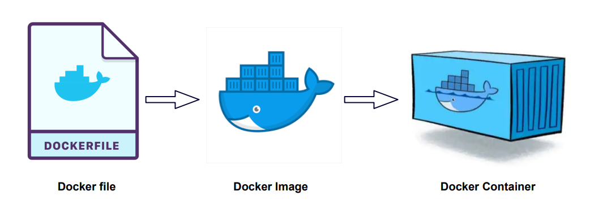

# Personalizando imágenes

Hasta ahora hemos visto que con el comando `docker pull` se puede utilizar una imagen ya construida, pero, ¿Cómo podemos construir nuestra propia imagen personalizada? Para esto se utiliza un archivo Dockerfile junto al comando `docker build`, el cual transforma las especificaciones del Dockerfile en una imagen utilizable



## Comandos basicos para un Dockerfile

`FROM [image:version]` define una imagen inicial sobre la cual se construye nuestra imagen personalizada

`COPY [source:destiny]` copia archivos/carpetas locales dentro de la imagen

`RUN [command]` ejecuta un comando dentro de la imagen

`CMD [command]` define el comando a ejecutar cuando la imagen se instancia en un contenedor

`WORKDIR [path]` define la ruta donde los comandos `COPY` `CMD` Y `RUN`

`ENV <key>=<value>` define una variable de entorno

### Ejemplo 1: construyendo nuestro primer archivo Dockerfile

Para este ejemplo, construiremos un Dockerfile con python y numpy. 
``` 
# Se comienza con una imagen basada en Archlinux
FROM archlinux  
#actualizamos los repositorios
RUN pacman -Sy
#instala python dentro de la imagen  
RUN pacman -S python --noconfirm
#instala pip dentro de la imagen 
RUN pacman -S python-pip --noconfirm
#instala la libreria numpy 
RUN pip install numpy
#Generamos artesanalmente un ejemplo de python con numpy
RUN echo "import numpy as np"  > numpy_test.py
RUN echo "print(np.zeros((2,2)))" >> numpy_test.py
#se define que al instanciar la imagen en un contenedor se corra por defecto python numpy_test.py
CMD ["python","numpy_test.py"]
```

Guardamos el archivo con el nombre de Dockerfile y listo.

## Dockerfile a imagen

Para construir una imagen a partir de un archivo Dockerfile, utilizaremos el comando 

`docker build [path_Dockerfile -t image_name]`

Una vez finalizado, puedes comprobar la imagen construida con

`docker images`


## Utilizar otras imagenes de base

Si bien, puedes construir imágenes desde 0 basadas en un sistema operativo, existen imágenes publicas en `https://hub.docker.com/`

