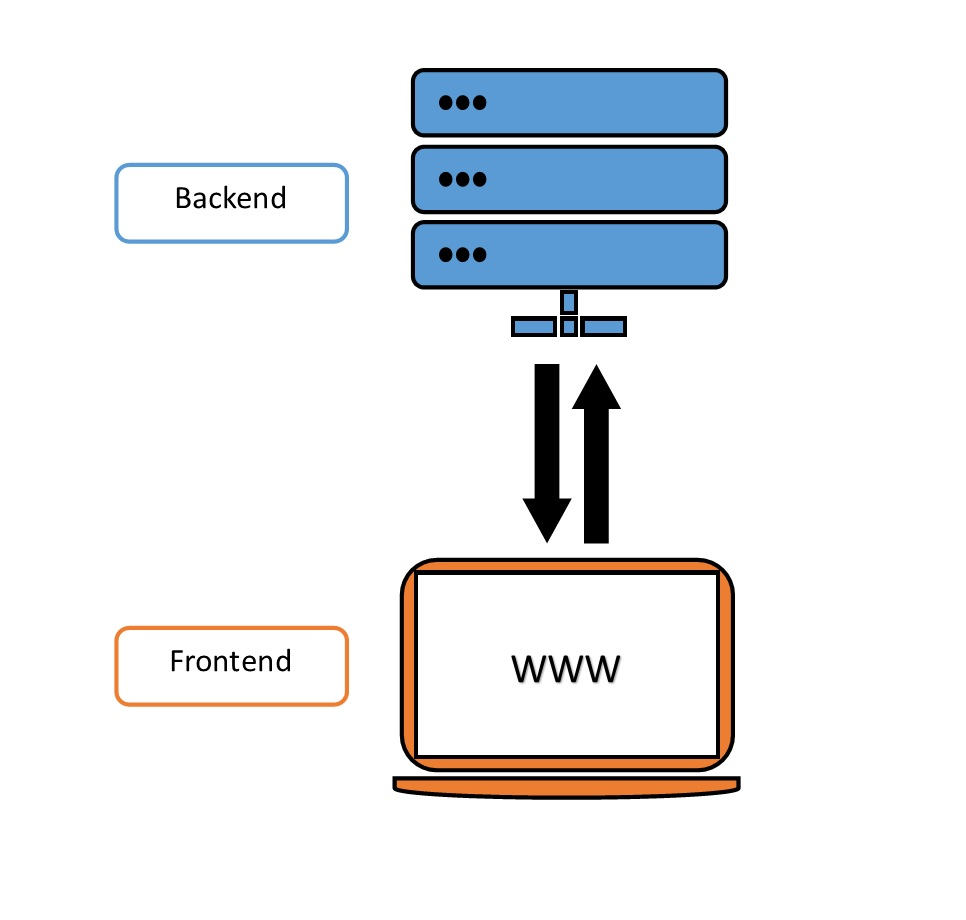

# Primeros pasos con Docker Compose

## ¿Qué es docker compose?

Docker compose es una herramienta que permite la integración de múltiples contenedores docker de manera sencilla. Análogo a docker con el archivo Dockerfile, la definición de la orquestación con docker compose se realiza a través del archivo docker-compose.yml. Un ejemplo bastante común es el uso de docker compose para orquestar aplicaciones web, ya que, normalmente se tienen dos componentes dockerizables: front end y back end. Ambos componentes deben interactuar entre si a través de una API.



Para buildear las imagenes de los servicios, utilizamos 

``` 
docker compose build

``` 

Para levantar servicios con docker compose, utilizamos 

``` 
docker compose up

``` 
Podemos utilizar build y up al mismo tiempo con

``` 
docker compose up --build

``` 

donde la definición y configuración de los servicios están en el archivo docker-compose.yml (ya veremos como escribir este tipo de archivos)

Para dar de baja los servicios levantados, utilizamos

``` 
docker compose down

```
Análogamente, si queremos reiniciar los servicios, lo indicamos con 

``` 
docker compose restart
``` 

Si queremos listar los servicios levantados por docker compose,

``` 
docker compose ps

``` 

EXTRA: con docker compose podemos escalar los servicios (volver aqui luego de ver la seccion de definicion de docker-compose.yml)

``` 
docker compose up --scale service=n

``` 


